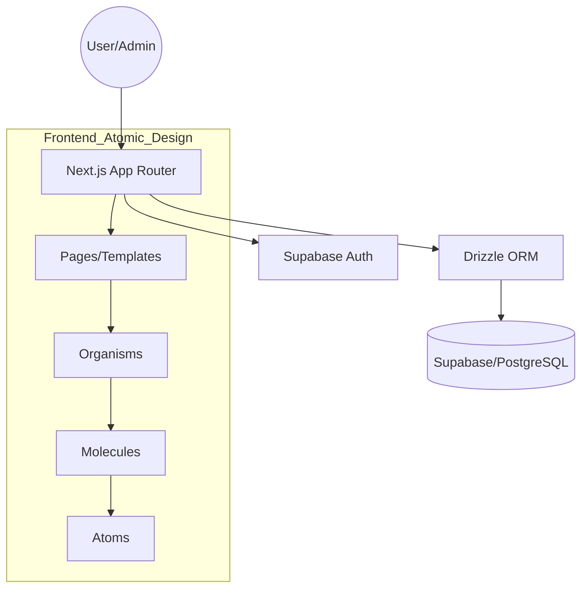
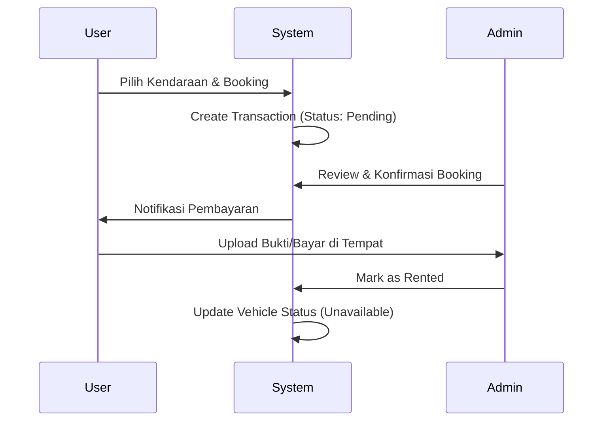

### TL;DR
Sistem akan dibangun menggunakan **Next.js 14 (App Router)**, **Supabase** sebagai backend/database, dan **Drizzle ORM**. Arsitektur frontend menggunakan **Atomic Design** untuk menjaga skalabilitas komponen. Admin panel fokus pada manajemen inventaris dan transaksi, sementara Landing Page fokus pada konversi penyewaan.

---

## plan.md

### 1. Project Overview
Membangun platform rental kendaraan (mobil/motor) terintegrasi. Sistem ini mencakup sisi publik untuk penyewa (browsing & booking) dan sisi admin untuk pengelolaan armada, status kendaraan, serta laporan transaksi.

### 2. Tech Stack
* **Frontend & Backend:** Next.js 14 (App Router, TypeScript).
* **Styling:** Tailwind CSS + **shadcn/ui** (sesuai standar UI Anda).
* **Database & Auth:** Supabase (PostgreSQL).
* **ORM:** Drizzle ORM.
* **State Management:** TanStack Query (React Query) untuk server state.
* **Validation:** Zod.

### 3. Features
#### **Public (Landing Page)**
* Hero section dengan pencarian tanggal & tipe kendaraan.
* Katalog kendaraan dengan filter (kategori, harga, transmisi).
* Detail kendaraan & Form Booking sederhana.
* Cek status transaksi via Invoice ID.

#### **Admin Dashboard**
* **Inventory Management:** CRUD armada (plat nomor, status: *available/rented/service*).
* **Transaction Management:** Approval booking, update status pembayaran, dan pengembalian.
* **Analytics:** Ringkasan pendapatan bulanan dan unit paling laku.

### 4. Constraints
* Admin harus login via Supabase Auth.
* Komponen React harus mengikuti struktur **Atomic Design**.
* Database menggunakan schema `public` di Supabase via Drizzle.

### 5. Task Breakdown
* **Phase 1:** Inisialisasi Project & Schema Database (Drizzle).
* **Phase 2:** Setup Atomic Components (Atoms: Buttons, Inputs; Molecules: Cards).
* **Phase 3:** Landing Page & Product Catalog.
* **Phase 4:** Admin Dashboard (Inventory & Transactions).
* **Phase 5:** Integrasi Auth & Status Update Logic.

### 6. Rules for AI Agent
* Gunakan struktur folder `src/components/atoms`, `src/components/molecules`, dst.
* Pisahkan logic server action di folder `src/app/actions`.
* Semua interface TypeScript harus diletakkan di `src/types`.
* Gunakan `lucide-react` untuk icon.

---

### 7. Diagrams

#### **Architecture Diagram**


#### **Transaction Flow**


---

### 8. Database Schema (Drizzle Example)
Untuk kebutuhan rental, berikut adalah struktur tabel utamanya:

```typescript
// src/db/schema.ts
import { pgTable, serial, text, integer, timestamp, pgEnum } from 'drizzle-orm/pg-core';

export const vehicleStatusEnum = pgEnum('vehicle_status', ['available', 'rented', 'service']);
export const transactionStatusEnum = pgEnum('transaction_status', ['pending', 'confirmed', 'completed', 'cancelled']);

export const vehicles = pgTable('vehicles', {
  id: serial('id').primaryKey(),
  name: text('name').notNull(),
  type: text('type').notNull(), // Mobil/Motor
  licensePlate: text('license_plate').unique().notNull(),
  pricePerDay: integer('price_per_day').notNull(),
  status: vehicleStatusEnum('status').default('available'),
  imageUrl: text('image_url'),
  createdAt: timestamp('created_at').defaultNow(),
});

export const transactions = pgTable('transactions', {
  id: serial('id').primaryKey(),
  vehicleId: integer('vehicle_id').references(() => vehicles.id),
  customerName: text('customer_name').notNull(),
  customerPhone: text('customer_phone').notNull(),
  startDate: timestamp('start_date').notNull(),
  endDate: timestamp('end_date').notNull(),
  totalPrice: integer('total_price').notNull(),
  status: transactionStatusEnum('status').default('pending'),
  createdAt: timestamp('created_at').defaultNow(),
});
```

---

### 9. Output Format & Folder Structure
```text
src/
├── app/              # Next.js App Router
├── components/       # Atomic Design
│   ├── atoms/        # Buttons, Badges, Inputs (shadcn)
│   ├── molecules/    # FormField, VehicleCard, NavItem
│   ├── organisms/    # Navbar, VehicleGrid, TransactionTable
│   └── templates/    # DashboardLayout, LandingLayout
├── db/               # Drizzle config & schemas
├── lib/              # Utils (cn, formatters)
└── types/            # TS Definitions
```

Apakah Anda ingin saya mendetailkan komponen **Organism** tertentu, misalnya tabel manajemen transaksi untuk admin?